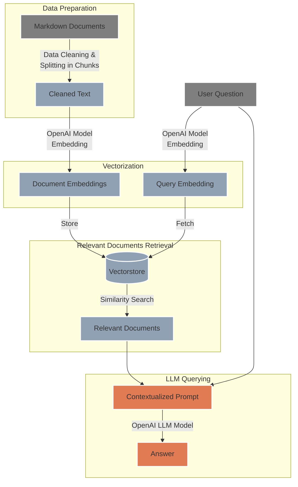

# `LLM RAG` - Advanced Streamlit RAG Application 🤖

## 🌟 Overview 
A sophisticated Retrieval-Augmented Generation (RAG) application built with Streamlit, leveraging OpenAI's Large Language Models and FAISS vector database. This application enables users to upload markdown documents 📂, ask intelligent questions about the content ❓, and receive contextually accurate AI-generated answers based on the uploaded knowledge base 📚.

### ✨ Key Features
- **Document Processing**: Upload and process markdown files with intelligent chunking
- **Vector Search**: Advanced similarity search using FAISS vector database
- **AI-Powered Q&A**: Context-aware responses using OpenAI's latest models
- **Interactive UI**: Clean, intuitive Streamlit interface
- **Customizable Settings**: Fine-tune model parameters and behavior
- **Docker Support**: Easy deployment with containerized application

## ❓ How It Works
The LLM RAG Streamlit app is structured into several key areas, each serving a specific function within the application:

<p align="center">
  
</p>

- **Setup Knowledge Base** 📂: Upload markdown documents to establish the knowledge base.
- **Explore Knowledge Base** 🔍: Browse and manage the uploaded documents.
- **RAG Query** 💡: Pose questions to receive answers referencing the knowledge base and the model's knowledge.

Additionally, the app offers advanced settings for customization based on user needs:

<p align="center">
  
</p>

- **OpenAI Embedding Model Settings**: Select the embedding model for document vectorization.
- **OpenAI LLM Settings**: Choose the OpenAI language model variant for generating answers.
- **LLM Temperature**: Adjust the creativity of the model’s responses.
- **Max Completion Tokens**: Define the maximum length of the generated response.
- **Drop All Documents in Knowledge Base**: Clear the database by typing a confirmatory command.

## 🛠️ System Architecture
The following diagram illustrates the flow of data through the system:



## Project Structure 🏗️
The project's main directories are laid out as follows:

```
LLM-RAG/
├── .github/workflows/          # CI/CD pipeline definitions
├── configs/                    # Configuration files for the model (model names, pricing..)
├── data/                       # Data and indices used by the app (FAISS Knowledge Base)
├── docker/                     # Docker related files 
├── notebooks/                  # Jupyter notebooks for experiments
├── secrets/                    # API keys and other secrets (excluded from version control)
├── src/                        # Source code for the LLM RAG logic
├── streamlit_app/              # Streamlit app files for the Web Interface
├── tests/                      # Test cases for the application
├── .dockerignore               # Specifies ignored files in Docker builds
├── .gitignore                  # Specifies untracked files ignored by git
├── Dockerfile                  # Dockerfile for building the Docker image
├── Makefile                    # Make commands for building and running the app 🧑‍💻
├── README.md                   # Documentation and instructions
├── requirements.txt            # Python dependencies for the project
└── (additional project files and scripts)
```

## 🚀 Getting Started

To begin using the LLM RAG app, follow these simple steps:

1. **Clone the Repository:**
   ```
   git clone https://github.com/labrijisaad/LLM-RAG.git
   ```

2. **Create the Environment:**
   Set up your virtual environment using either venv or conda:
   ```
   # Using venv
   python -m venv env_llm_rag
   source env_llm_rag/bin/activate
   
   # Using conda
   conda create --name env_llm_rag
   conda activate env_llm_rag
   ```

3. **Install Dependencies:**
   Install the required dependencies by

 running:
   ```
   pip install -r requirements.txt
   ```

4. **Set Up OpenAI API:**
   Rename the example credentials file to `secrets/credentials.yml` and replace the placeholder key ('sk-xxx') with your actual OpenAI API key. You can obtain your API key by following the instructions provided in the [OpenAI documentation](https://platform.openai.com/docs/quickstart?context=python).
   ```
   rename secrets/credentials-example.yml secrets/credentials.yml
   ```

5. **Run the Streamlit App:**
   Launch the Streamlit app using either the provided Makefile command or directly via the Streamlit CLI:
   ```
   # Using Makefile
   make stream
   
   # Or directly
   streamlit run streamlit_app/main.py
   ```
## 🐳 Docker Version

The application is available as a Docker container and can be easily set up and run with a few commands. If you want to run the application using the Docker image from the public registry, ensure that you have a `secrets` directory with the necessary API keys as specified in the `secrets/credentials.yml`.

To pull and run the Docker container:

1. **Pull the Docker Image:**
   You can pull the image directly from **Google Artifact Registry** using the following command:
   ```shell
   docker pull europe-west1-docker.pkg.dev/llm-rag-application/llm-rag/llm_rag_app:latest
   ```

2. **Run the Docker Container:**
   After pulling the image, you can run it with:
   ```shell
   docker run -p 8501:8501 -v $(pwd)/secrets:/app/secrets europe-west1-docker.pkg.dev/llm-rag-application/llm-rag/llm_rag_app:latest
   ```
   This command will start the container and mount your **`secrets`** directory for the application to use.

If you prefer to use the **Makefile**, the equivalent commands are provided for convenience:

```shell
# To pull the Docker image
make docker-pull

# To run the pulled Docker image
make docker-run-pulled
```

The Streamlit app will be available at **`http://localhost:8501`** once the container is running.


## 🛠️ Technology Stack

### **Backend & AI**
- **Python 3.8+** - Core programming language
- **Streamlit** - Web application framework
- **OpenAI API** - Large Language Model integration
- **FAISS** - Vector similarity search and clustering
- **LangChain** - LLM application framework
- **Pandas** - Data manipulation and analysis

### **Infrastructure & Deployment**
- **Docker** - Containerization
- **Google Artifact Registry** - Container registry
- **GitHub Actions** - CI/CD pipeline
- **Makefile** - Build automation

### **Data Processing**
- **Markdown Processing** - Document parsing and chunking
- **Text Embeddings** - Vector representation of text
- **Similarity Search** - Efficient document retrieval

## 🚀 Quick Start

### **Prerequisites**
- Python 3.8 or higher
- OpenAI API key
- Docker (optional, for containerized deployment)

### **Installation**

1. **Clone the Repository:**
   ```bash
   git clone https://github.com/Ravindranathrl/LLM-RAG-PROJECT-WITH-STREAMLIT.git
   cd LLM-RAG-PROJECT-WITH-STREAMLIT
   ```

2. **Create Virtual Environment:**
   ```bash
   # Using venv
   python -m venv env_llm_rag
   source env_llm_rag/bin/activate  # On Windows: env_llm_rag\Scripts\activate
   
   # Using conda
   conda create --name env_llm_rag python=3.8
   conda activate env_llm_rag
   ```

3. **Install Dependencies:**
   ```bash
   pip install -r requirements.txt
   ```

4. **Configure API Keys:**
   ```bash
   # Create secrets directory
   mkdir secrets
   
   # Copy and edit credentials
   cp secrets/credentials-example.yml secrets/credentials.yml
   # Edit secrets/credentials.yml with your OpenAI API key
   ```

5. **Run the Application:**
   ```bash
   # Using Makefile
   make stream
   
   # Or directly
   streamlit run streamlit_app/main.py
   ```

   The application will be available at `http://localhost:8501`

## 🐳 Docker Deployment

### **Using Pre-built Image**
```bash
# Pull the Docker image
docker pull europe-west1-docker.pkg.dev/llm-rag-application/llm-rag/llm_rag_app:latest

# Run the container
docker run -p 8501:8501 -v $(pwd)/secrets:/app/secrets europe-west1-docker.pkg.dev/llm-rag-application/llm-rag/llm_rag_app:latest
```

### **Building from Source**
```bash
# Build the Docker image
make docker-build

# Run the built image
make docker-run
```

## 📊 Performance & Features

### **Advanced Capabilities**
- **Intelligent Chunking**: Smart document segmentation for optimal retrieval
- **Context-Aware Responses**: Answers based on relevant document sections
- **Model Flexibility**: Support for multiple OpenAI models (GPT-3.5, GPT-4, etc.)
- **Parameter Tuning**: Adjustable temperature, max tokens, and model selection
- **Batch Processing**: Efficient handling of multiple documents

### **Use Cases**
- **Document Q&A Systems**: Answer questions about uploaded documents
- **Knowledge Base Search**: Search through large document collections
- **Research Assistant**: Help with research and information extraction
- **Content Analysis**: Analyze and summarize document content
- **Educational Tools**: Interactive learning with document-based Q&A

## 🔧 Configuration

### **Model Settings**
- **Embedding Model**: Choose from various OpenAI embedding models
- **LLM Model**: Select the language model for response generation
- **Temperature**: Control response creativity (0.0 - 2.0)
- **Max Tokens**: Set maximum response length
- **Chunk Size**: Configure document chunking parameters

### **API Configuration**
The application uses a YAML configuration file for API settings:
```yaml
openai:
  api_key: "your-api-key-here"
  embedding_model: "text-embedding-ada-002"
  llm_model: "gpt-3.5-turbo"
  temperature: 0.7
  max_tokens: 1000
```

## 🤝 Contributing

Contributions are welcome! Please feel free to submit a Pull Request. For major changes, please open an issue first to discuss what you would like to change.

### **Development Setup**
1. Fork the repository
2. Create a feature branch (`git checkout -b feature/amazing-feature`)
3. Commit your changes (`git commit -m 'Add some amazing feature'`)
4. Push to the branch (`git push origin feature/amazing-feature`)
5. Open a Pull Request

## 📄 License

This project is licensed under the MIT License - see the [LICENSE](LICENSE) file for details.

## 🌐 Connect with me
<div align="center">
  <a href="https://www.linkedin.com/in/ravindranath-rl/">
    
  </a>
  <a href="https://github.com/Ravindranathrl">
    
  </a>
</div>

---

<div align="center">
  <p><strong>Built with ❤️ by Ravindranath RL</strong></p>
  <p>Full-Stack Software Engineer | AI/ML Enthusiast | Cloud Solutions Architect</p>
</div>
